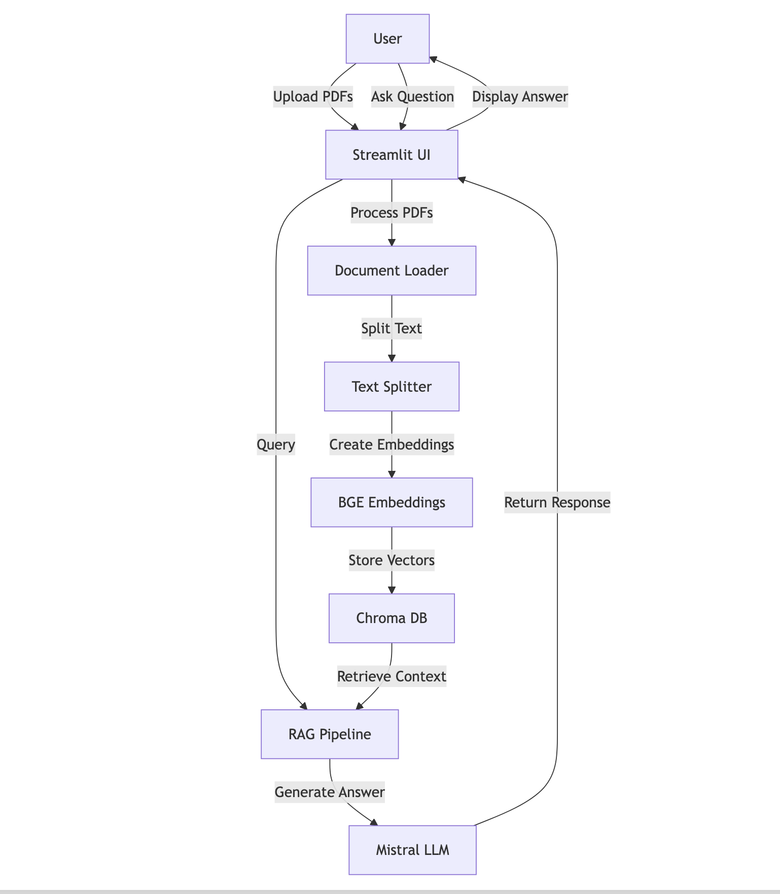
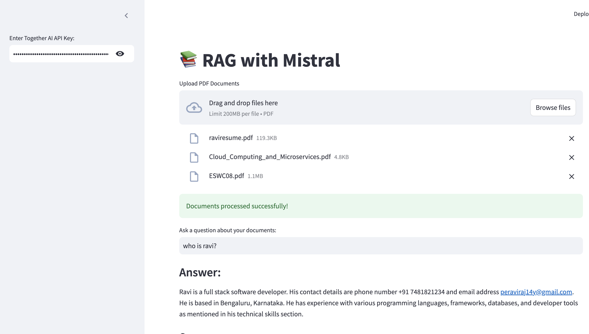

# 📚 DocChat with Mistral

A powerful document Q&A application that combines RAG (Retrieval Augmented Generation) with Mistral LLM to provide intelligent answers from your PDF documents.

## 🔍 Architecture



## 🚀 Features

- PDF document upload and processing
- Intelligent question answering using Mistral LLM
- RAG architecture for accurate and contextual responses
- Vector storage using Chroma DB
- Source attribution for answers
- User-friendly interface built with Streamlit

## 🛠️ Technologies Used

- LangChain
- Mistral AI (via Together AI)
- Streamlit
- Chroma DB
- HuggingFace Embeddings (BGE-base-en)
- PyPDF Loader

## 📋 Requirements

- Python 3.9+
- Together AI API key
- Required Python packages (see requirements.txt)

## 🔧 Installation

1. Clone the repository:

```bash
git clone https://github.com/raviX007/doc-chat-mistral.git
cd doc-chat-mistral
```

2. Install dependencies in a virtual environment:

```bash
python3 -m venv venv
source venv/bin/activate
pip install -r requirements.txt
```

```bash
pip install -r requirements.txt
```

3. Run the application:

```bash
streamlit run app.py
```

## 💻 Usage

1. Enter your Together AI API key in the sidebar
2. Upload one or more PDF documents
3. Wait for the documents to be processed
4. Ask questions about your documents
5. View answers and their sources

## 📄 Requirements.txt

```
langchain
langchain_community
langchain_core
streamlit
together
chromadb
pydantic
transformers
torch
sentence_transformers
PyPDF2
```

## Screenshot of working Application


